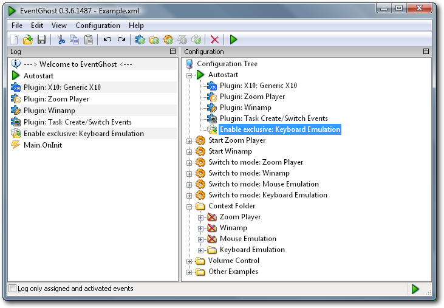
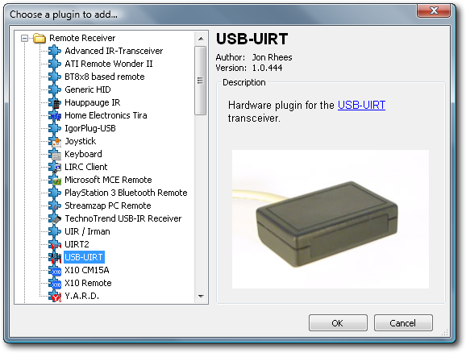
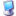
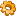
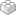
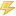

:tocdepth: 1

============
Short Manual
============

Main Window
===========

Logger Pane
===========

Configuration Pane
==================

|RootSymbol| Configuration Tree
-------------------------------
The Configuration Tree contains the complete EventGhost configuration and is
made up of containers and items.

All containers and items except Autostart can be enabled/disabled manually
and by Actions.

|AutostartSymbol| Autostart
---------------------------

Autostart is a special container that can hold Plugins to load and Actions to
execute every time the Configuration Tree is loaded (eg EventGhost is started).
There is always a single Autostart item in the Configuration Tree and it
cannot be removed or disabled.

|FolderSymbol| Folders
----------------------

Folders are named containers that can hold Macros and/or more Folders. They
are used to structure your configuration as you see fit.

|MacroSymbol| Macros
--------------------
Macros are named containers that can hold Events to trigger the Macro and
Actions to execute when the Macro is triggered.

For example:

* You press the button labeled *TV* on your remote control.
* The Plugin for your remote sees that you pressed the *TV* button and
  generates a *TV* Event.
* Any active Macros that contain the *TV* Event are triggered and begin
  executing their Actions.

|PluginSymbol| Plugins
----------------------

Plugins extend the functionality of EventGhost by generating Events and/or
adding additional Actions. Plugins are always placed in the Autostart
container.

|EventSymbol| Events
--------------------

Events are the triggers that cause Macros to execute their Actions. They are
generated by EventGhost and Plugins. Events generated by Plugins are usually
prefixed with the Plugin's name, so if you were using an X10 remote in the
example above, the X10 Remote Plugin would have generated an X10.TV Event.

|ActionSymbol| Actions
----------------------

Actions are the commands that are executed when a Macro is triggered by an
Event. They are provided by Plugins.

Adding Plugins
==============

Adding new Plugins to your configuration is very simple:

* Select the :menuselection:`Configuration-->Add Plugin...` menu item
* Select the Plugin you want to add from the list
* Click the OK button

The Plugin you selected will be added to the Autostart container and a dialog
may appear to configure additional settings if needed.

See the :ref:`PluginList` for more details on the available Plugins.

Assigning Events to Macros
==========================

There are three ways you can assign trigger Events to a Macro:

#. Drag-and-drop an Event from the Log to an existing Macro in the
   Configuration Tree.
#. Select an Event in the Log and copy it to the clipboard using Ctrl+C,
   :menuselection:`Right-Click-->Copy`, or :menuselection:`Edit-->Copy`, then
   select an existing Macro in the Configuration Tree and paste the Event
   using Ctrl+V, :menuselection:`Right-Click-->Paste`, or
   :menuselection:`Edit-->Paste`.
#. Select an existing Macro in the Configuration Tree and then add a new Event
   using :menuselection:`Right-Click-->Add Event`,
   :menuselection:`Configuration-->Add Event`
   or clicking the :guilabel:`Add Event` toolbar button.

You can rename any existing Event by selecting it and pressing F2, or
selecting :menuselection:`Right-Click-->Rename` Item or
:menuselection:`Configuration-->Rename Item`, and typing the new Event name.

