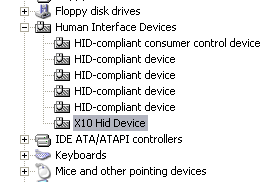

===========
X10 Remotes
===========

If you notice, that your remote sends keystrokes even if EventGhost is not 
started, you most likely have installed the wrong driver. Some manufacturers 
deliver a driver, that registers the remote as a HID (Human Interface Device).
Even though HID might be fine, if you really don't won't to use any third party
program, it gives you trouble with tools like EventGhost, because they are not
able to stop these drivers from sending keystrokes.

To make sure which driver your remote currently uses, open the device manager 
and look for a category "Human Interface Devices". If you find an entry named 
"X10 Hid Device" there, you have the wrong driver.

Sadly this X10-HID driver is not so easy to uninstall. If you right click on
the entry, you won't find any option to uninstall it. To get rid of it, you 
have to use some tricks:

(These instructions are for Windows XP)

#. Unplug the USB receiver from your system.
#. Right click on the "X10 Hid Device" entry and choose :guilabel:`Update 
   Driver`.
#. The "Hardware Update Wizard" will popup. If you are asked to connect to
   Windows Update, choose the :guilabel:`No, not this time` radio box and 
   press :guilabel:`Next`.
#. On the next page you are asked what you want the wizard to do. Choose 
   :guilabel:`Install from a list or specific location (Advanced)` and press 
   :guilabel:`Next`.
#. On the next page select :guilabel:`Don't search, I will choose the driver 
   to install.` and press :guilabel:`Next`.
#. Now you should see a list that includes the "X10 Hid Device" entry. Above
   this list is a check box called :guilabel:`Show compatible hardware`. 
   Un-check this box.
#. On the left side you now see a manufacturer list. Scroll it up to the top 
   and select :guilabel:`(Standard system devices)`.
#. The first entry on the right side should now be :guilabel:`2-axis, 2-button 
   joystick`. Select this entry and press :guilabel:`Next`.
#. You will now get a warning dialog, that it is not recommended to install
   this driver. Ignore it and press :guilabel:`Yes`.
#. Now press :guilabel:`Finish` on the last page and if you are asked to 
   restart your computer now, affirm it with :guilabel:`Yes` and let the 
   computer reboot.
#. After your computer is back, open the device manager again. You will now 
   see the joystick entry with a yellow exclamation mark. Right click this 
   entry to open the context menu and choose :guilabel:`Uninstall`. Affirm 
   that you really want to uninstall it on the next dialog and the entry 
   should disappear.
   
Now you should install the proper driver before you reconnect your receiver.

You can download the driver here:

* `X10 driver for 32-bit Windows <http://www.eventghost.net/downloads/x10drivers_x86.exe>`_.
* `X10 driver for 64-bit Windows <http://www.eventghost.net/downloads/x10drivers_x64.exe>`_.

