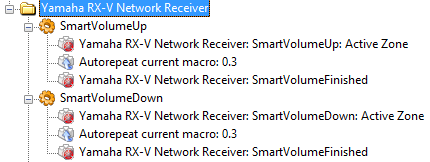

Yamaha Network Receivers
=========

About
-----
This is a plugin for [EventGhost] which allows you to control your Yamaha AV Receivers over the internet (local network). It should work with most/all Yamaha RX-Vxxx models which contain either an ethernet connection or a wireless connection.  The computer running [EventGhost] should be on the same local network, or you will need to use port forwarding.

Tested Models
------
```
RX-V867 [working]
RX-V473 [working]
RX-V775 [working]
```

Supported Models (Incomplete)
------
Typically, any `Yamaha RX-Vxxx` models are supported. Here is an incomplete list of (possibly) supported models.
```
RX-V867, RX-V1067, RX-V2067

RX-V671, RX-V871

RX-V473, RX-V573, RX-V673, RX-V773

RX-V475, RX-V575, RX-V675, RX-V775
```

Functions
---------
- Increase Volume (User defined increment)
- Decrease Volume (User defined decrement)
- Set Exact Volume (User defined)
- Toggle Mute
- Set Input Source (HDMI1, HDMI2, AV1, V-AUX, etc)
- Set Scene # (User defined)
- Power: On, Off, Standby, Toggle On/Standby
- Toggle Surround Decode / Straight
- Toggle Enhancer
- Next Radio Preset
- Previous Radio Preset
- Toggle Radio AM/FM
- Radio Auto Freq Up
- Radio Auto Freq Down
- Radio Freq Up
- Radio Freq Down

+ Cursor Actions (Choose Main Zone / Zone 2):
    + Up
    + Down
    + Left
    + Right
    + Enter
    + Return
    + Level
    + On Screen
    + Option
    + Top Menu
    + Pop Up Menu

- NumChar Actions (Choose Main Zone / Zone 2):
    - 1
    - 2
    - 3
    - 4
    - 5
    - 6
    - 7
    - 8
    - 9
    - 0
    - +10
    - ENT

+ Operation Actions (Choose Main Zone / Zone 2):
    + Play
    + Stop
    + Pause
    + Search-
    + Search+
    + Skip-
    + Skip+
    + FM
    + AM

Smart Volume Usage
--------
<br />


Credits
--------
+ Anthony Casagrande (BirdAPI)
+ Jason Kloepping (Dragon470)

[EventGhost]: http://www.eventghost.org/
